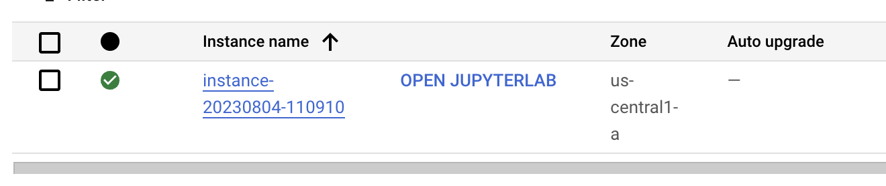
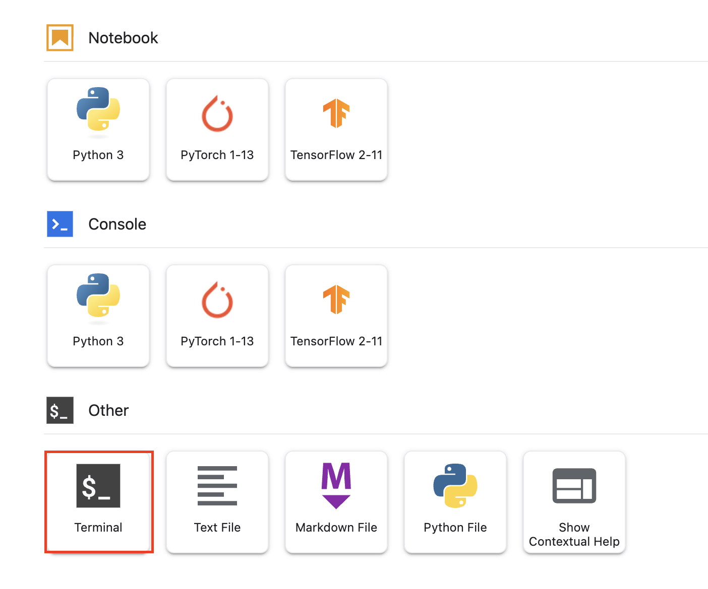

# Overview

This is part of the JAPAC Generative AI Technical Workshop qwiklabs. The workshop walk the audiences through:

* Google Generative AI Language offerings
* Langchain integration

## Provision Cloud Resources

1. Configure Google Cloud Environment

    If you are running the lab in Qwiklabs environment, you can skip step 2.

To manually configure the Google Cloud project:

Ensure the following services are enabled in your GCP Project:

    * Cloud Resource Manager API

    * Compute Engine API

    * Identity and Access Management (IAM) API

2. Use Terraform to create and configure required resources.

- Goto `terraform/qwiklabs` folder.

    ```shell
    cd terraform/qwiklabs
    ```

- create `terraform.tfvars` file with the following content

    ```ini
    gcp_project_id=<YOUR GCP PROJECT ID>
    gcp_region=<DEFAULT GCP PROJECT ID> 
    gcp_zone=<DEFAULT GCP PROJECT ID> 
    ```

- Apply terraform to privision Google Cloud Resources.

    ```shell
    terraform init
    terraform plan -var-file=terraform.tfvars
    terraform apply -var-file=terraform.tfvars
    ```

    This will create the following resources:
        1. A VPC with firewall rules which allows 80, 8080, 23 TCP inbound traffics.
        2. Service Network peering with the VPC.

At this point, you have provisioned required cloud resources.

## Create Vertex AI Workbench as the lab environment.

In this lab, we use Vertex AI Workbench as the lab environment.

1. Follow the [instruction](https://cloud.google.com/vertex-ai/docs/workbench/instances/create-console-quickstart) to provision Vertex AI Workbench Instance.

2. Once the Workbench instance is created. Open the notebook.

    

3. Open terminal.

    

4. Run the following commands in the terminal.

    ```shell
    export GOOGLE_CLOUD_PROJECT=$(gcloud config get project)
    export GOOGLE_CLOUD_REGION=us-central1
    export GOOGLE_CLOUD_ZONE=us-central1-a

    git clone https://github.com/GoogleCloudPlatform/solutions-genai-llm-workshop

    cd solutions-genai-llm-workshop

    python3 -m venv .venv

    curl -sSL https://raw.githubusercontent.com/python-poetry/install.python-poetry.org/385616cd90816622a087450643fba971d3b46d8c/install-poetry.py | python3 -

    source .venv/bin/activate
    curl -sS https://bootstrap.pypa.io/get-pip.py | python3

    pip install -r requirements.in
    ```

5. Authenticate to the Google Cloud Project

    ```shell
    gcloud auth login # Login with project owner account
    gcloud auth application-default login # Login with project owner account

    ```

5. Assign required roles to the user.

    ```shell
    export USER_EMAIL=<USE ACCOUNT EMAIL>
    gcloud projects add-iam-policy-binding $GOOGLE_CLOUD_PROJECT --member=user:$USER_EMAIL --role=roles/ml.admin

    gcloud projects add-iam-policy-binding $GOOGLE_CLOUD_PROJECT --member=user:$USER_EMAIL --role=roles/aiplatform.admin

    gcloud projects add-iam-policy-binding $GOOGLE_CLOUD_PROJECT --member=user:$USER_EMAIL --role=roles/aiplatform.user

    gcloud projects add-iam-policy-binding $GOOGLE_CLOUD_PROJECT --member=user:$USER_EMAIL --role=roles/serviceusage.serviceUsageConsumer

    ```

7. Create BigQuery dataset

    ```shell
    python3 1-create-and-copy-bq-data.py
    ```

8. Create Vertex Matching Engine, this can take around 60 minutes.

    ```shell
    curl -L https://tinyurl.com/genai-202307-dataset --output dataset.zip
    unzip dataset.zip
    rm dataset.zip

    python3 0-setup-matching-enging.py	
    ```

